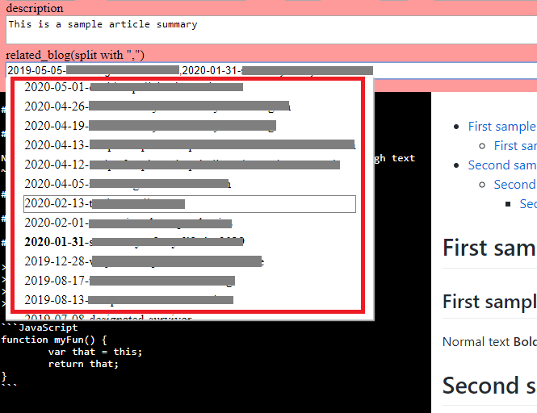

# april-cms 

Github repo: [https://github.com/c53hzn/april-cms](https://github.com/c53hzn/april-cms)

[april-cms English description](#april-cms-English-description)

[april-cms 中文说明](#april-cms-中文说明)

[给我充电](#给我充电)

## april-cms English description

A flat-file and also API-based CMS(content management system), initially designed for my Nuxt blog website project.

### Start and run

First clone this repo

```
git clone https://github.com/c53hzn/april-cms.git
```

Then install the dependencies

```
npm install
```

To start API and open interface on Chrome, run the following command. If you haven't installed Chrome, please have a try, and this interface is designed to be opened on Chrome by default.

```
npm start
```

### Interface

You can use the interface to create/modify/delete blog articles, which are stored as Markdown files in `blog` folder.

**Please note that you must use full slug with date in `related_blog` rather than short slug.**

Interface Preview


For `related_blog`, you can use dropdown menu to select related blog slugs.



### API

And you can use it for `Nuxt` or any `JAMstack` projects.

For blog list, just call `http://127.0.0.1:4000/blog`

For specific blog article content, if under dev mode, call `http://127.0.0.1:4000/blog?slug=yourslug&isdev=true`

If it is static/server mode, call `http://127.0.0.1:4000/blog?slug=yourslug`

To switch between short slug mode and long slug with date mode, change `config.js`.

**In order to handle `related_blog`, you must call `http://127.0.0.1:4000/config` first and confirm if `config.isSlugUseDate == true` then can you decide how to call and handle `related_blog`.**

For tag list, call `http://127.0.0.1:4000/blog?tag=all_tags`

For blog article list of specific tag, call `http://127.0.0.1:4000/blog?tag=yourtag`

And if you want to scrape the image assets, you can call `http://127.0.0.1:4000/blog?img=all_imgs`.

Feedbacks are more than welcome~

## april-cms 中文说明

本项目为操作纯文本文件的基于 API 的内容管理系统，最初是为 Nuxt 博客网站项目设计的。

### 启动

先把这个 repo 克隆到你的电脑上

```
git clone https://github.com/c53hzn/april-cms.git
```

然后安装依赖

```
npm install
```

要启动 API 并在 Chrome 上打开操作界面，请在命令行中使用以下的命令。如果你的电脑上没有安装 Chrome，趁此机会装一个吧。本项目的操作界面默认打开 Chrome 浏览器。

```
npm start
```

### 操作界面

你可以使用操作界面来创建/修改/删除博客文章，相关文章将会以 Markdown 文件格式保存在 `blog` 文件夹里面.

**请注意，在`related_blog`里面必须使用带日期的长slug。**

操作界面预览


要输入 `related_blog` 时，可以使用下拉菜单选择关联的博客文章的 slug。


### API

如果你有一些 `Nuxt` 或任何 `JAMstack` 的项目，都可以用这个 CMS 的 API.

要获取所有文章列表，可以使用此 API： `http://127.0.0.1:4000/blog`

要获取特定文章的内容，如果在开发模式下，可以使用此 API： `http://127.0.0.1:4000/blog?slug=yourslug&isdev=true`

如果是在生成静态文件时或者是服务器上使用，可以用这个 API： `http://127.0.0.1:4000/blog?slug=yourslug`

如果想在带日期的长 `slug` 和不带日期的短 `slug` 中间切换，可以在 `config.js` 里面设置。

**为方便处理 `related_blog`，你必须先调用 `http://127.0.0.1:4000/config` 并确定是否有 `config.isSlugUseDate == true`，然后才可以决定如何调用并处理 `related_blog`。**

要获取标签列表，可以使用此 API： `http://127.0.0.1:4000/blog?tag=all_tags`

要获取某标签下的文章列表，可以使用此 API： `http://127.0.0.1:4000/blog?tag=yourtag`

如果你想获取 CMS 里面所有图片资源，可以用这个 API： `http://127.0.0.1:4000/blog?img=all_imgs`.

## 给我充电

我的爱发电主页 [https://afdian.net/@c53hzn](https://afdian.net/@c53hzn)

请我喝杯肥宅水，写起代码再不累~

请我喝一杯咖啡，从此我们一起飞~

欢迎讨论本项目的任何问题，有什么意见建议都欢迎提出~
